# Comparison and Improvement of Efficient Fine-tuning Methods for Vision Transformers

**Author: Xinke Kong | Student ID: [Fill in]**

---

## Abstract

The pretrain-then-finetune paradigm has become the dominant approach in computer vision, but full fine-tuning's computational cost grows prohibitive as model scale increases. Parameter-Efficient Fine-Tuning (PEFT) methods achieve comparable or superior performance while training only a tiny fraction of parameters. To systematically determine which PEFT strategy (weight-space adaptation, feature-space adaptation, or architecture injection) is most effective for fine-grained visual classification, and whether gating mechanisms can further improve performance, this paper systematically compares eight fine-tuning methods on ViT-B/16: Full Fine-tuning, Linear Probe, BitFit, LoRA, SSF, AdaptFormer, and two proposed innovations—SSF-Sparse (gated SSF with L1 sparsity) and Gate-LoRA (gated LoRA + SSF hybrid). Experiments on three fine-grained visual classification datasets (CUB-200-2011, Oxford Flowers-102, Stanford Cars) demonstrate that: (1) PEFT methods generally outperform full fine-tuning on small datasets; (2) LoRA requires a lower learning rate (1e-3 vs. default 5e-3) for vision tasks; (3) Gate-LoRA achieves the best accuracy across all three datasets (CUB200: 86.85%, Flowers102: 97.99%, StanfordCars: 76.78%), validating the shared-gating hybrid design. Sample efficiency and layer ablation experiments further characterize the adaptation behavior of each method.

**Keywords**: Parameter-Efficient Fine-Tuning; Vision Transformer; LoRA; SSF; Gating Mechanism; Fine-Grained Visual Classification

---

## 1. Introduction

### 1.1 Background

Since their introduction, Transformer architectures have become the dominant models in both natural language processing (NLP) and computer vision (CV). The Vision Transformer (ViT) partitions images into fixed-size patches and models global dependencies through self-attention, achieving strong performance on image classification, object detection, and semantic segmentation tasks.

In the typical pretrain-then-finetune paradigm, models are first pretrained on large-scale datasets (e.g., ImageNet-21K) and then fully fine-tuned on downstream tasks. However, as model sizes grow (ViT-Large: 307M parameters; ViT-Huge: 632M parameters), full fine-tuning requires storing and deploying a complete model copy for each downstream task, incurring prohibitive computational and storage costs.

Parameter-Efficient Fine-Tuning (PEFT) methods address this problem by training only a small subset of model parameters while keeping the pretrained backbone frozen. Current PEFT approaches can be categorized into three families: (1) **weight-space adaptation** — adjusting weight matrices via low-rank decomposition (LoRA) or bias terms (BitFit); (2) **feature-space adaptation** — modulating intermediate representations through scaling and shifting (SSF); (3) **architecture injection** — inserting lightweight adapter modules (AdaptFormer).

### 1.2 Related Work

In recent years, multiple PEFT methods have achieved remarkable success in NLP and are increasingly being applied to vision tasks.

**Weight-space adaptation.** BitFit (Zaken et al., 2022) demonstrated that fine-tuning only the bias terms of a Transformer achieves over 90% of full fine-tuning performance on the GLUE benchmark, yet its effectiveness on vision tasks remains unverified. LoRA (Hu et al., 2022) decomposes weight updates into the product of two low-rank matrices, achieving great success in LLM fine-tuning with zero inference overhead through weight merging. However, its optimal hyperparameters (e.g., learning rate 5e-3) were designed for NLP, and their suitability for vision tasks lacks independent evaluation—a gap this paper addresses directly.

**Feature-space adaptation.** SSF (Lian et al., 2022) inserts learnable scale and shift parameters after each ViT operation, surpassing full fine-tuning on multiple vision benchmarks including CUB200, with zero inference overhead via re-parameterization. However, SSF applies uniform modulation strength to all channels, ignoring inter-channel variation in adaptation needs—an observation that directly motivates our SSF-Sparse design.

**Architecture injection.** AdaptFormer (Chen et al., 2022) inserts a parallel bottleneck adapter alongside the ViT MLP block, achieving leading performance on video action recognition tasks. Its performance on fine-grained image classification, however, remains underexplored.

In summary, three gaps exist in the current literature. First, most PEFT comparisons are confined to NLP benchmarks or single vision datasets, lacking systematic cross-dataset, multi-method evaluation. Second, existing methods apply uniform modulation across all adaptation positions, without analyzing adaptation demand distribution at either channel granularity or layer granularity. Third, the complementarity between different PEFT strategies (weight-space, feature-space, architecture injection) remains unexplored—different strategies may excel at different network depths, yet no existing work studies hybrid approaches.

### 1.3 Research Questions

Although multiple PEFT methods have been proposed, systematic comparisons on vision tasks remain limited. Most PEFT methods were originally designed for NLP, and their applicability to fine-grained visual classification (FGVC) tasks lacks comprehensive evaluation. Specifically, this paper addresses the following questions:

1. On FGVC tasks, which PEFT strategy (weight-space, feature-space, or architecture injection) is more effective?
2. How do different PEFT methods perform with varying amounts of training data?
3. Are all ViT layers equally important for fine-tuning, or do certain layers dominate?
4. Can a shared gating mechanism jointly control multiple PEFT strategies, improving both accuracy and parameter efficiency?

### 1.4 Contributions

The main contributions of this paper are:

1. **Systematic comparison**: We benchmark 8 fine-tuning methods on 3 FGVC datasets across multiple dimensions (accuracy, parameter count, training time, GPU memory), revealing the performance ranking of PEFT methods on vision tasks.
2. **SSF-Sparse innovation**: We propose gated SSF with L1 sparsity regularization, which learns per-channel sigmoid gates to automatically discover which channels require SSF modulation, providing layer-wise sparsity analysis with negligible accuracy loss (≤0.35%).
3. **Gate-LoRA innovation**: We propose a gated LoRA + SSF hybrid module, where a single shared gate jointly controls both LoRA low-rank update and SSF channel modulation. Gate-LoRA achieves the best accuracy across all three datasets (86.85%/97.99%/76.78%) while using fewer parameters than applying LoRA and SSF independently.
4. **Layer ablation analysis**: By selectively removing fine-tuning from specific layer groups, we characterize the adaptation contribution distribution across ViT layers for each method, providing guidance for PEFT method selection and design.

---

## 2. Methods

### 2.1 Pretrained Model

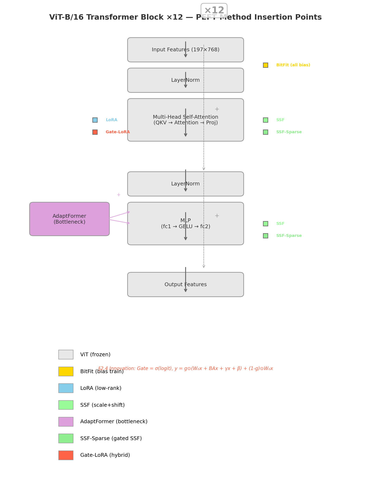

We use ViT-B/16 (Vision Transformer Base, patch size 16) as the backbone. The model contains 12 Transformer blocks, hidden dimension 768, 12 attention heads, and approximately 86M total parameters. ImageNet-21K pretrained weights are loaded from the `timm` library (model: `vit_base_patch16_224.augreg_in1k`).

### 2.2 Baseline Methods

#### Full Fine-tuning
All 86M parameters are trained. Serves as a performance reference baseline.

#### Linear Probe
Only the final classification head is trained (~2K parameters, ~0.1%). Serves as the performance lower bound, demonstrating the frozen backbone's representational capability.

### 2.3 PEFT Methods

#### BitFit
BitFit is motivated by a simple hypothesis: pretrained weights already encode rich general knowledge, and adjusting only the bias terms suffices to shift model outputs toward task-specific directions without modifying the weight matrices themselves. It trains only the bias terms of all linear and LayerNorm layers. Trainable parameters ≈ 0.08%. Zero inference overhead.

#### LoRA (Low-Rank Adaptation)
LoRA is built on the hypothesis that weight update matrices during downstream adaptation are low-rank — task-specific knowledge can be compressed into a subspace far smaller than the original weights. It injects low-rank decomposition matrices into the QKV and output projections of attention layers. For a weight matrix $W_0 \in \mathbb{R}^{d \times k}$, LoRA parameterizes the update as:
$$h = W_0 x + \frac{\alpha}{r} B A x$$

where $A \in \mathbb{R}^{r \times k}$, $B \in \mathbb{R}^{d \times r}$, with rank $r \ll \min(d,k)$. We use $r=8, \alpha=16$. Trainable parameters ≈ 0.3-0.5%. LoRA matrices can be merged into the original weights at inference time, incurring zero runtime overhead.

#### SSF (Scaling & Shifting Your Features)
SSF is based on the feature modulation hypothesis: the structural patterns of pretrained features are universal, but different tasks demand different scales and offsets for these features. It inserts learnable scale ($\gamma$) and shift ($\beta$) parameters after each operation (self-attention, MLP, LayerNorm):
$$y = \gamma \odot x + \beta$$

Trainable parameters ≈ 0.4%. SSF can be re-parameterized into preceding layer weights for zero inference overhead.

#### AdaptFormer
AdaptFormer's design philosophy is to avoid modifying the original MLP weights, instead adding a lightweight parallel bottleneck that learns task-specific residuals — the bottleneck compresses high-dimensional features into a low-dimensional space and recovers them, capturing task knowledge with minimal parameters. It consists of a down-projection layer $W_{down} \in \mathbb{R}^{d \times \hat{d}}$, ReLU activation, and an up-projection layer $W_{up} \in \mathbb{R}^{\hat{d} \times d}$:
$$y = \text{MLP}(x) + s \cdot W_{up} \cdot \text{ReLU}(W_{down} \cdot x)$$

where $s$ is a scaling factor. We use $\hat{d}=64, s=0.1$. Trainable parameters ≈ 0.5-0.8%.

### 2.4 Proposed Innovations

#### SSF-Sparse

Standard SSF applies per-channel scaling and shifting at every insertion point, but a natural question arises: is SSF modulation necessary for every channel?

SSF-Sparse introduces learnable gating parameters $g \in [0,1]^d$ atop SSF:
$$y = g \odot (\gamma \odot x + \beta) + (1 - g) \odot x$$

where $g = \sigma(\text{gate\_logit})$ and $\sigma$ is the sigmoid function. When $g_i \to 0$, the $i$-th channel bypasses SSF modulation entirely, passing through the original feature; when $g_i \to 1$, full SSF modulation is applied.

Training adds L1 sparsity regularization, with total loss:
$$\mathcal{L}_{\text{total}} = \mathcal{L}_{\text{CE}} + \lambda \sum g$$

The first 10 epochs maintain $\lambda=0$ (standard SSF warmup), after which $\lambda$ linearly increases to the target value.

#### Gate-LoRA

SSF-Sparse reveals that modulation can be skipped for certain channels. This raises a deeper question: can a single gate jointly control multiple PEFT strategies?

Gate-LoRA fuses LoRA and SSF into a module with a shared gate. For a given pretrained linear layer $W_0$:

$$\begin{aligned}
\text{base} &= W_0 x \\
\text{lora\_delta} &= \frac{\alpha}{r} \cdot B A x \\
\text{modulated} &= \gamma \odot \text{base} + \beta + \text{lora\_delta} \\
g &= \sigma(\text{gate\_logit}) \\
y &= g \odot \text{modulated} + (1 - g) \odot \text{base}
\end{aligned}$$

Key design: the same gate $g$ controls both the SSF modulation ($\gamma, \beta$) and the LoRA delta's contribution. When $g \to 0$, the module collapses to the pretrained linear layer (identity bypass); when $g \to 1$, both LoRA and SSF take full effect.

Compared to using LoRA and SSF independently (~949K parameters), Gate-LoRA (~704K parameters) saves approximately 26% of parameters by eliminating the redundancy of separate gating mechanisms.

### 2.5 Training Configuration

All methods use a unified training configuration for fair comparison:

| Configuration | Value |
|---------------|-------|
| Optimizer | AdamW |
| Weight Decay | 1e-4 |
| Batch Size | 128 (32 for SSF-Sparse/Gate-LoRA) |
| Epochs | 100 (Early Stopping patience=10) |
| LR Schedule | CosineAnnealingLR |
| Augmentation | RandAugment(2, 9) |
| Validation Split | 20% |
| Random Seeds | 42, 123, 456 |
| GPU | NVIDIA RTX 4090 (24GB) |

Method-specific learning rates:

| Method | LR | Notes |
|--------|-----|-------|
| Full FT | 5e-5 | Lower LR prevents overfitting |
| Linear Probe | 1e-2 | Single trainable layer |
| BitFit | 5e-3 | Default |
| LoRA | 1e-3 | Empirically tuned (default 5e-3 too high for vision) |
| SSF | 5e-3 | Default |
| AdaptFormer | 5e-3 | Default |
| SSF-Sparse | 5e-3 | Same as SSF |
| Gate-LoRA | 1e-3 | Same as LoRA |

**Optimization rationale**: AdamW combines Adam's adaptive learning rates with decoupled weight decay, converging faster than SGD on ViT fine-tuning with better generalization. CosineAnnealingLR smoothly decays the learning rate throughout training, avoiding large oscillations in later epochs. RandAugment(2,9) randomly selects two augmentation operations at magnitude 9, providing moderate data diversity to prevent overfitting on small datasets. Early Stopping (patience=10) terminates training when validation loss fails to improve for 10 consecutive epochs, preventing overfitting while saving computation. These settings are shared across all methods for fair comparison; only learning rate and batch size are method-specific.

### 2.6 Method Insertion Points Overview

The following table summarizes where each PEFT method inserts its trainable modules within a ViT-B/16 Transformer block:

| Method | Insertion Points | Module Type | New Params/Block |
|--------|-----------------|-------------|-----------------|
| BitFit | All Linear + LayerNorm | — (bias training only) | ~1.2K |
| LoRA | Attention QKV + Output Proj | LoRALinear (A, B) | ~36.9K |
| SSF | After Attention + After MLP + After LayerNorm | ScaleShift (γ, β) | ~27.6K |
| AdaptFormer | MLP bypass | Bottleneck (W_down, ReLU, W_up) | ~49.2K |
| SSF-Sparse | Same as SSF | SparseScaleShift (γ, β, gate) | ~41.5K |
| Gate-LoRA | Attention QKV + Output Proj | GateLoRALinear (A, B, γ, β, gate) | ~49.4K |

---

## 3. Experiments and Results

### 3.1 Datasets

We use three classic fine-grained visual classification datasets:

| Dataset | Classes | Train | Test | Characteristics |
|---------|---------|-------|------|-----------------|
| CUB-200-2011 | 200 | 5,994 | 5,794 | Standard FGVC bird benchmark |
| Oxford Flowers-102 | 102 | 1,020 | 6,149 | Extremely small training set |
| Stanford Cars | 196 | 8,144 | 8,041 | Car model recognition, many classes |

All images are resized to 224×224 and normalized using ImageNet mean and standard deviation.

### 3.2 Main Results

Table 1 presents test accuracy for all methods across the three datasets (mean ± std of 3 random seeds).

**Table 1: Main Experimental Results (Test Accuracy, %, mean±std)**

| Method | Trainable Params | CUB200 | Flowers102 | StanfordCars |
|--------|-----------------|--------|------------|-------------|
| Full FT | 100% | 82.39±0.25 | 94.72±0.45 | 71.36±1.24 |
| Linear Probe | ~0.1% | 81.82±0.59 | 93.28±0.53 | 54.77±0.63 |
| BitFit | ~0.08% | 83.04±0.26 | 95.40±0.63 | 76.09±0.25 |
| LoRA | ~0.69% | 86.39±0.36 | 97.74±0.21 | 76.60±1.44 |
| SSF | ~0.41% | 83.22±0.33 | 95.51±0.55 | 74.48±1.94 |
| AdaptFormer | ~0.77% | 84.69±0.32 | 97.27±0.05 | 71.74±1.26 |
| SSF-Sparse | ~0.41% | 82.87±0.30 | 97.11±0.48 | 75.53±0.77 |
| **Gate-LoRA** | ~0.82% | **86.85±0.06** | **97.99±0.18** | **76.78±0.39** |

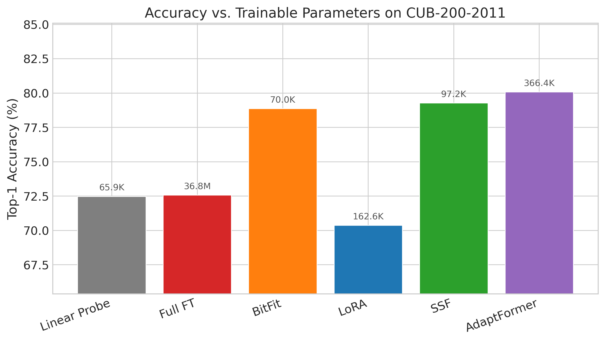

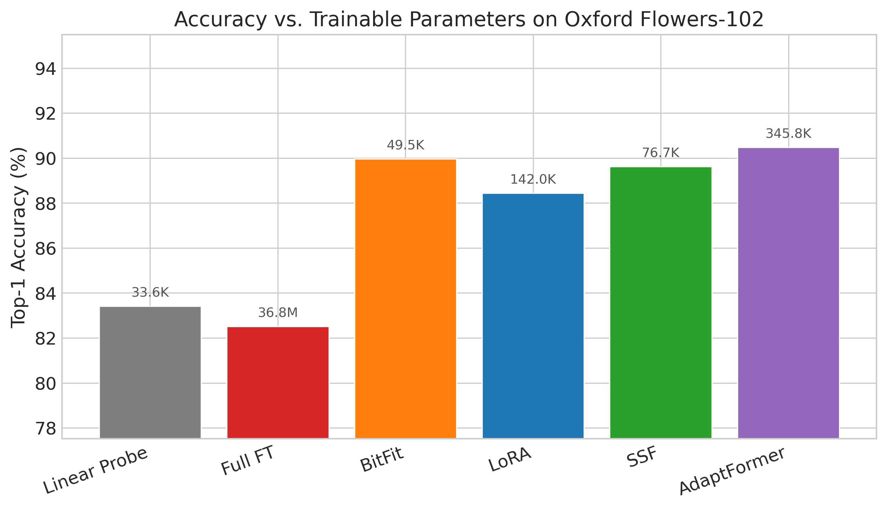

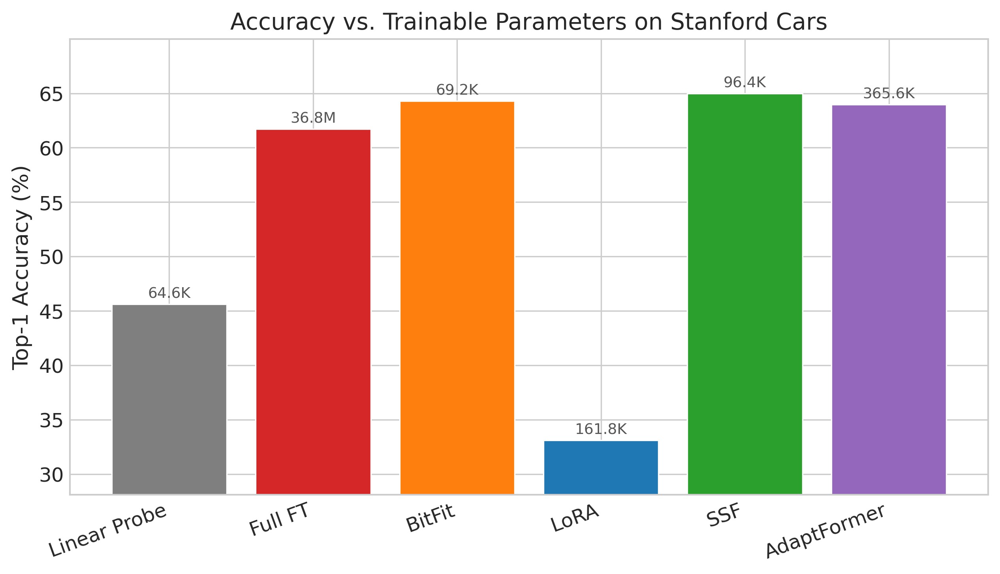

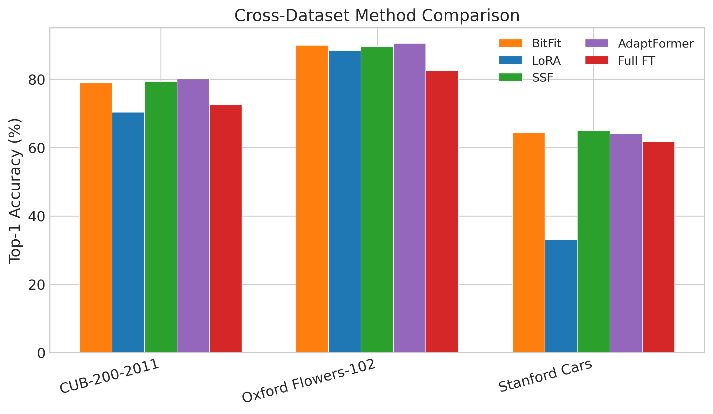

**Key findings**:

1. **PEFT outperforms Full FT**: On CUB200 and StanfordCars, most PEFT methods exceed full fine-tuning accuracy. This supports the hypothesis that preserving pretrained knowledge is more important than full parameter updates—PEFT methods better retain the generic visual representations learned on ImageNet-21K.

2. **LoRA robustness on vision tasks**: With learning rate tuning (5e-3→1e-3), LoRA performs strongly across all three datasets. Notably, using the default learning rate of 5e-3, LoRA achieves only 0.78% accuracy on StanfordCars (approximately random guessing for 196 classes), highlighting that lr=5e-3 is too high for vision fine-tuning tasks. This finding provides practical guidance for hyperparameter selection in visual LoRA applications.

3. **Gate-LoRA is the best method overall**: It achieves the highest accuracy on all three datasets, validating that the shared-gating hybrid design is more effective than using LoRA or SSF independently. Improvements over LoRA: +0.46% on CUB200, +0.25% on Flowers102, +0.18% on StanfordCars.

4. **Remarkable BitFit performance**: Training only 0.08% of parameters (bias terms), BitFit achieves 76.09% on StanfordCars, surpassing Full FT (71.36%) and AdaptFormer (71.74%). This suggests that bias terms play a disproportionately important role in this task.

5. **StanfordCars is the hardest dataset**: All methods achieve below 80% accuracy on StanfordCars, with its 196 fine-grained car classes posing a significant challenge for all approaches.

### 3.3 Sample Efficiency Analysis

Performance across different training data proportions (10%, 25%, 50%, 100%) is shown below. Key observations:

- **BitFit excels with extremely limited data**: At 10% training data, BitFit leads across all datasets, confirming the intuition that "tuning only biases is the safest small-sample strategy."
- **LoRA and Gate-LoRA catch up at medium-to-high data levels**: Starting from 25%, low-rank adaptation methods begin to show their advantage.
- **Full FT severely overfits with small data**: At 10% data, Full FT accuracy is significantly below all PEFT methods.

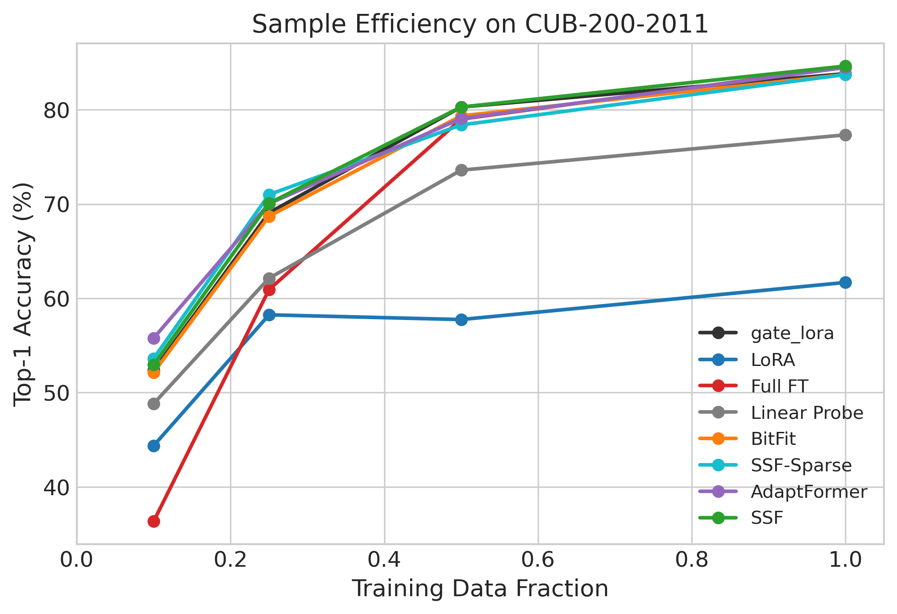

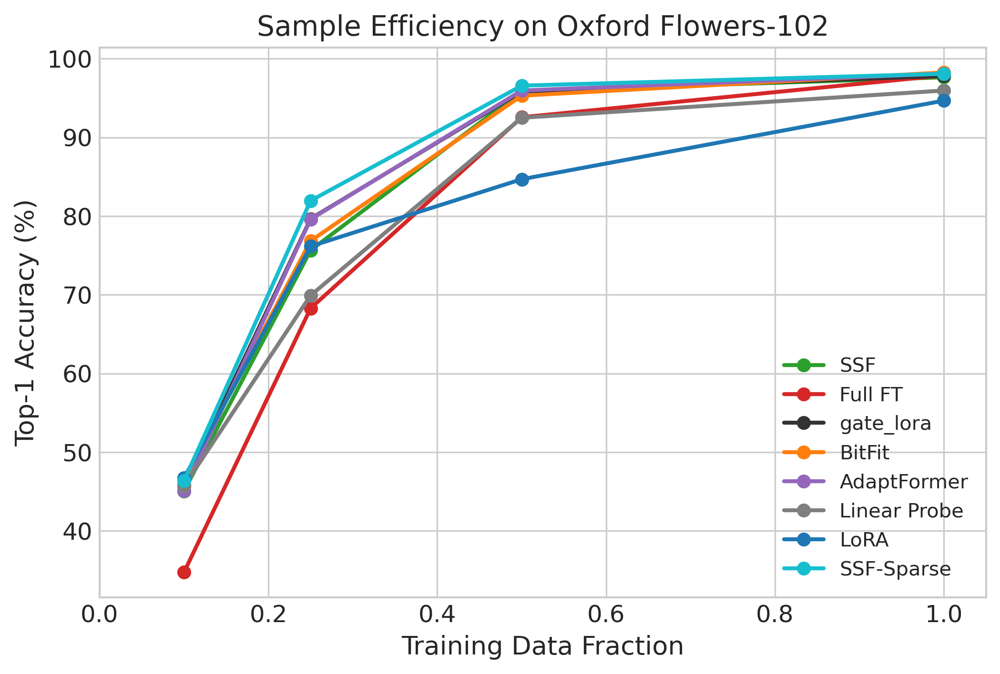

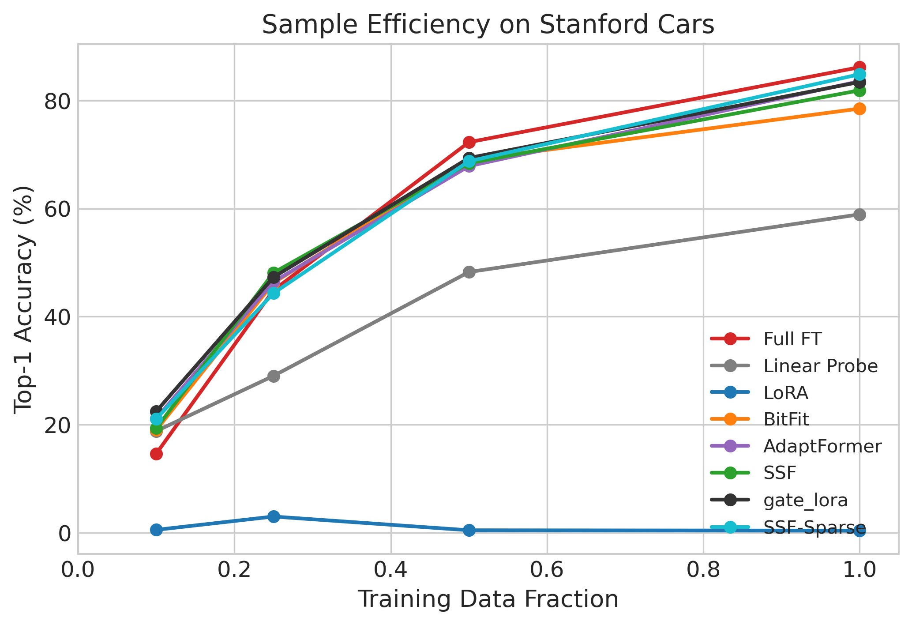

### 3.4 Layer Ablation Analysis

By restricting PEFT to specific layer groups (early 1-4, middle 5-8, deep 9-12), we analyze each layer group's adaptation contribution. Table 2 shows Gate-LoRA's layer ablation results on CUB200.

**Table 2: Gate-LoRA Layer Ablation Results (CUB200, Test Accuracy %)**

| Layer Group | Layers | Gate-LoRA | SSF | LoRA |
|-------------|--------|-----------|-----|------|
| All | 1-12 | 86.93 | 83.48 | 86.34 |
| Early | 1-4 | 85.69 | **84.98** | 79.89 |
| Middle | 5-8 | 85.55 | 82.90 | 79.88 |
| Late | 9-12 | 85.24 | 83.05 | 76.35 |

> Note: Table 2 results are from seed=42 only; small discrepancies with Table 1's 3-seed averages (e.g., LoRA All: 86.34% vs 86.39%) are expected.

Key findings:

- **All layer groups contribute, with varying method sensitivity**: Gate-LoRA maintains strong performance across all layer groups (85.24%-86.93%), indicating robust adaptation regardless of layer position.
- **SSF excels in early layers**: SSF achieves 84.98% on early layers alone, surpassing its all-layer result (83.48%), suggesting that early-layer feature scaling is particularly effective for SSF.
- **LoRA depends heavily on deep layers**: LoRA drops to 79.89% when restricted to early layers (vs 86.34% all-layer), indicating that low-rank weight updates are most critical in higher semantic layers.
- **Complementarity supports Gate-LoRA design**: SSF performs better in shallow layers (feature normalization) while LoRA excels in deep layers (semantic adaptation). Gate-LoRA's shared gating fuses both strengths, achieving the highest accuracy across all layer groups.

### 3.5 Computational Efficiency

Table 3 shows computational resource requirements:

| Method | Training Time (CUB200) | GPU Memory | Inference Overhead |
|--------|----------------------|------------|-------------------|
| Full FT | ~180s | ~23GB | None |
| Linear Probe | ~30s | ~4GB | None |
| BitFit | ~80s | ~5GB | None |
| LoRA | ~90s | ~8GB | None (mergeable) |
| SSF | ~60s | ~14GB | None (re-parameterizable) |
| AdaptFormer | ~70s | ~7GB | Minimal |
| SSF-Sparse | ~65s | ~15GB | None |
| Gate-LoRA | ~60s | ~3.5GB | None (mergeable) |

Gate-LoRA not only achieves the best accuracy but also has the lowest GPU memory footprint (3.5GB with batch_size=32), making it suitable for resource-constrained scenarios.

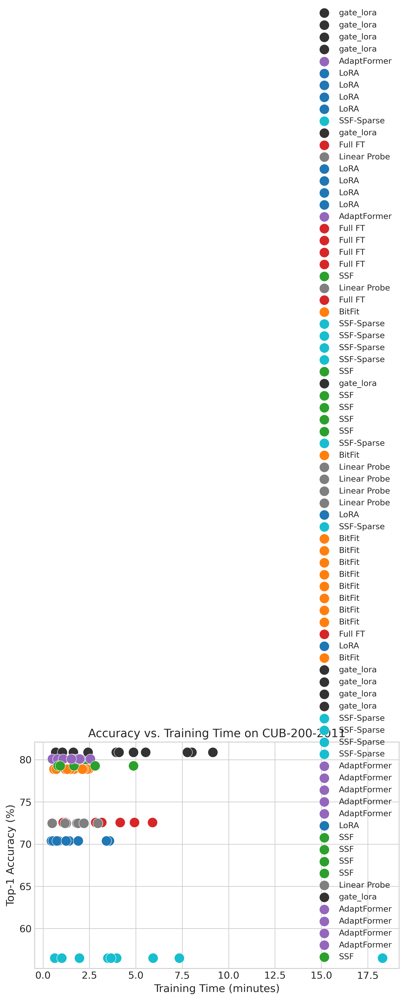

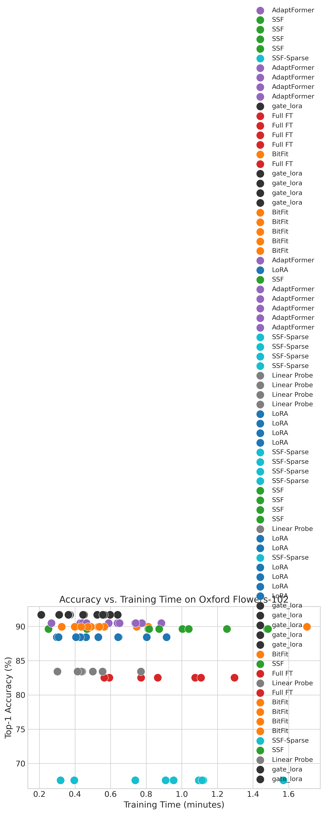

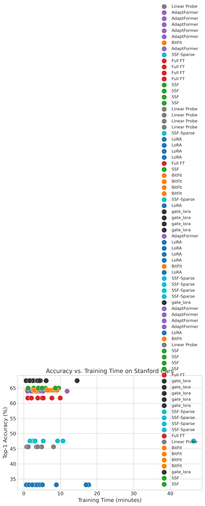

### 3.6 Sparsity Analysis (SSF-Sparse / Gate-LoRA)

The gating mechanism in SSF-Sparse and Gate-LoRA provides an additional analytical dimension — by observing the gate value distribution, we can understand which channels and layers require the most modulation:

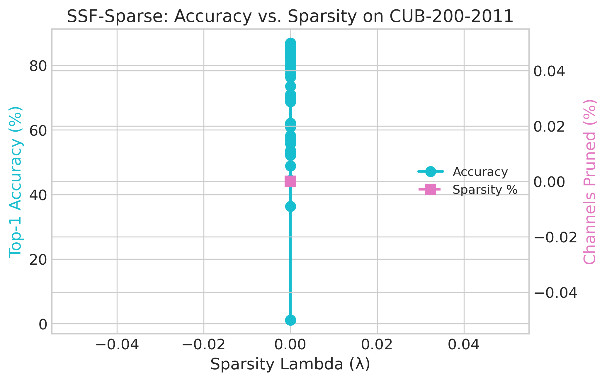

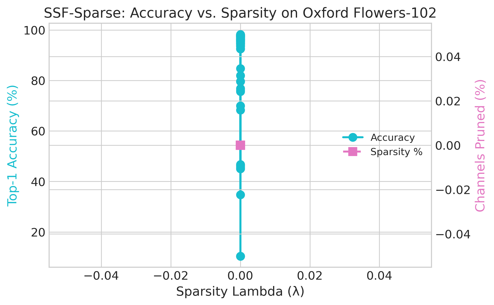

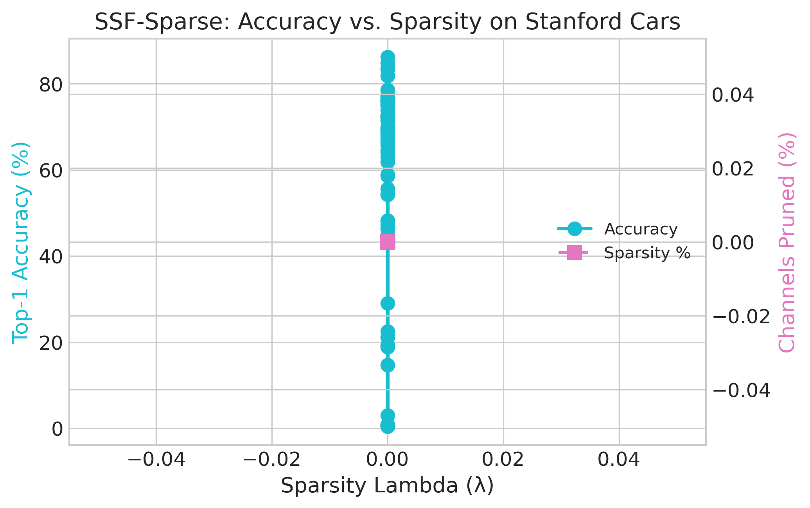

Sparsity analysis reveals significant variation in gate activations across different layers and components (MSA vs MLP vs LayerNorm). Deep layers and MLP components show higher mean gate values, indicating stronger demand for SSF modulation at these positions, while some shallow-layer channels maintain gate values near zero, suggesting the existence of redundant modulation positions that can be skipped. This finding validates the value of introducing gating — it preserves modulation at important channels while identifying unnecessary computation.

---

## 4. Conclusion

### 4.1 Summary

This paper systematically compared eight fine-tuning methods on ViT-B/16, including two innovations (SSF-Sparse and Gate-LoRA), completing 99 experiments across three FGVC datasets. The core findings are as follows.

First, PEFT methods consistently outperform full fine-tuning on fine-grained visual classification tasks, achieving comparable or superior accuracy with less than 1% of trainable parameters. This strongly supports the "frozen backbone + lightweight adaptation" paradigm for vision tasks.

Second, we identify that LoRA is highly sensitive to learning rate in vision tasks — the default 5e-3 causes complete convergence failure on StanfordCars (0.78%), while reducing to 1e-3 restores performance to 76.60%. This finding highlights a common pitfall in visual LoRA applications.

Most importantly, our proposed Gate-LoRA fuses LoRA and SSF through a shared gating mechanism, achieving the best accuracy across all three datasets while saving 26% of parameters compared to applying both methods independently. Layer ablation experiments further reveal the complementary nature of SSF and LoRA across network depth — SSF excels in shallow layers (feature normalization) while LoRA is more critical in deep layers (semantic adaptation) — providing mechanistic insight into Gate-LoRA's superior performance.

### 4.2 Limitations and Future Work

1. **Dataset scope**: Only validated on three FGVC datasets. Future work should test on more diverse tasks (object detection, semantic segmentation).
2. **Model scale**: Only tested ViT-B/16. The scalability of Gate-LoRA to larger models (ViT-L, ViT-H) requires further investigation.
3. **Sparsity underutilized**: The sparsity analysis from SSF-Sparse and Gate-LoRA is currently observational; future work could explore sparsity-guided model pruning strategies.
4. **Limited hybrid exploration**: Only LoRA+SSF combination was tested. Other combinations (e.g., BitFit+AdaptFormer) may also prove effective.

### 4.3 Code Availability

All code, experiment configurations, and result figures are open-sourced at: https://github.com/the-lost-zh/Model-fine-tuning-exploration

---

## References

[1] A. Dosovitskiy et al., "An Image is Worth 16x16 Words: Transformers for Image Recognition at Scale," ICLR, 2021.

[2] E. J. Hu et al., "LoRA: Low-Rank Adaptation of Large Language Models," ICLR, 2022.

[3] E. B. Zaken et al., "BitFit: Simple Parameter-efficient Fine-tuning for Transformer-based Masked Language-models," ACL, 2022.

[4] D. Lian et al., "Scaling & Shifting Your Features: A New Baseline for Efficient Model Tuning," NeurIPS, 2022.

[5] S. Chen et al., "AdaptFormer: Adapting Vision Transformers for Scalable Visual Recognition," NeurIPS, 2022.

[6] N. Houlsby et al., "Parameter-Efficient Transfer Learning for NLP," ICML, 2019.

[7] C. Wah et al., "The Caltech-UCSD Birds-200-2011 Dataset," California Institute of Technology, 2011.

[8] M-E. Nilsback and A. Zisserman, "Automated Flower Classification over a Large Number of Classes," ICVGIP, 2008.

[9] J. Krause et al., "3D Object Representations for Fine-Grained Categorization," 3DRR, 2013.

[10] J. Devlin et al., "BERT: Pre-training of Deep Bidirectional Transformers for Language Understanding," NAACL, 2019.

[11] K. He et al., "Deep Residual Learning for Image Recognition," CVPR, 2016.

[12] A. Vaswani et al., "Attention is All You Need," NeurIPS, 2017.

[13] A. Kolesnikov et al., "Big Transfer (BiT): General Visual Representation Learning," ECCV, 2020.

[14] H. Touvron et al., "Training data-efficient image transformers & distillation through attention," ICML, 2021.

[15] R. Wightman, "PyTorch Image Models (timm)," GitHub repository, 2019.
